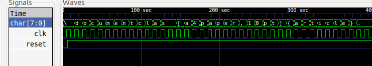

# resume\_generator\_schematic

Flow to generate a schematic representation of an input text file (in this case, my resume) 

When invoked Makefile will 

  * Use gen\_text.py to generate a gen\_text.v representation of an input file (resume.tex)
    and tb\_gen\_text.v to simulate it 
  * tb\_gen\_text.v will be simulated using icarus verilog, output will saved to resume\_sim.tex  
  * yosys will gen\_text.v to syn\_gen\_text.v and syn\_gen\_text.json
  * netlistsvg will be used to generate syn\_gen\_text.svg from syn\_gen\_text.json

